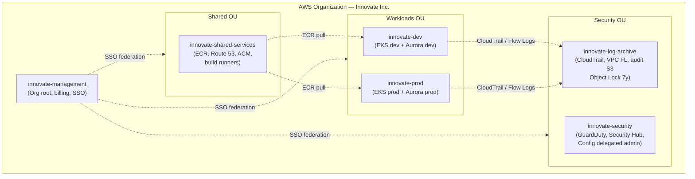
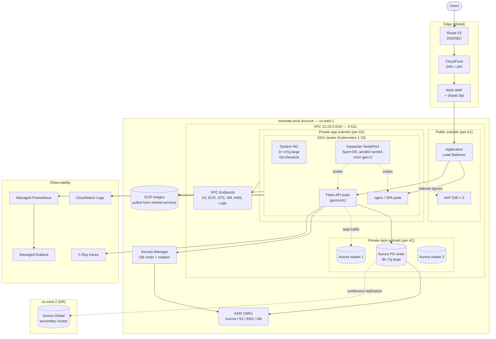

# Innovate Inc. — Cloud Architecture Proposal

A proposal for a robust, scalable, secure, and cost-effective AWS architecture for Innovate Inc.'s web application.

Davit Madoyan · May 2026

---

## EXECUTIVE SUMMARY

### What This Document Covers

This document outlines my proposed cloud architecture for Innovate Inc.: a React SPA + Python/Flask REST API backed by PostgreSQL, handling sensitive user data, deployed on AWS with managed Kubernetes. The goal is an environment that runs comfortably at hundreds of users per day on day one and scales to millions without re-architecting, while meeting the security bar that "sensitive user data" demands.

I am not proposing a theoretical reference architecture. It is shaped by what already exists in this repository — the Terraform under [`../terraform/`](../terraform/) already provisions EKS with Karpenter on AWS — and by the realities of a small startup: limited operations capacity, a need to be cost-aware, and a roadmap that must survive 100× growth.

I am also not proposing a perfect system on day one. I am proposing a foundation that does not need to be rebuilt later. Where I defer a decision (Aurora Serverless v2 for prod, multi-region active-active, a `staging` account), I name the trigger that should bring it back.

---

## ASSUMPTIONS

### What I Am Assuming

Before going into specifics, I want to call out the assumptions I am working with. These are based on the problem description and what is already in the repository.

- **AWS is the cloud.** The existing Terraform is on AWS (EKS + Karpenter), and GCP would not deliver enough advantage to justify a cross-cloud rebuild. I cover the GCP comparison briefly in [Tradeoffs](#tradeoffs).
- **The team is small to start** (3–10 engineers). The design must be operable by a few people, not a dedicated platform team. Wherever I add a managed service, it is partly to avoid hiring someone to run the unmanaged version.
- **Sensitive user data is in scope** but no specific compliance regime (SOC 2 / PCI / HIPAA) is firm yet. I design to the *spirit* of all of them — encryption, audit logging, least privilege, immutable trails — without claiming certification.
- **Primary region is `us-east-1`, DR region is `us-west-2`.** Confirm based on user geography. Switching is cheap if done before launch.
- **Innovate Inc. uses Google Workspace or Entra ID today** for email/calendar. Both can act as the SSO identity source. If they use something else, the IdP changes but the architecture does not.
- **Aiming for ~99.9% availability** on launch, with headroom to push to 99.95%+ once active-active multi-region is in place.
- **Development and staging environments will exist.** Staging starts as a namespace in the dev account; it is promoted to its own account once that distinction matters (regulator, release manager, or real risk of cross-contamination).

If any of these are wrong, the design needs revisiting before implementation — I'd rather find out now than after the Terraform applies.

---

## CURRENT STATE

### What Innovate Inc. Is Solving For

Innovate Inc. is a small startup with limited cloud experience, building a web app that handles sensitive user data and expects to grow from hundreds of users to millions. The combination is what makes this interesting:

**A startup-shaped operational budget.** A 5-person team cannot run a dedicated SRE rotation, manage their own Postgres, or staff a 24/7 incident response. The architecture has to lean on managed services aggressively.

**An enterprise-shaped security bar.** Sensitive user data means strong encryption, full audit trails, least-privilege access, and threat detection from day one. "We'll add security later" is not viable here — retrofitting CloudTrail, KMS, and multi-account isolation onto a running system is painful and expensive.

**A growth curve that crosses two thresholds.** Hundreds of users per day is comfortable on almost any setup. Millions of users per day is a different system. The architecture has to start cheap, but every decision should be checked against "does this survive 100× traffic?"

**CI/CD as a baseline expectation.** Not optional — manual deploys are how startups acquire prod incidents.

These four constraints push the design toward: managed everything (EKS, Aurora, ACM, Secrets Manager), multi-account from day one (cheap to do now, painful to retrofit), Spot + Graviton everywhere (cost lever that compounds), and a GitOps pipeline (so the deploy mechanism scales without becoming a bottleneck).

---

## APPROACH

### How I Think About This

The biggest leverage point for a small team is **picking the right boundaries and letting AWS run as much as possible inside them**.

The boundaries I care about most:

1. **Account boundary** — the only true blast-radius boundary in AWS. Worth getting right on day one, even at 5 people, because the cost is one Control Tower setup and the cost of *not* having it is a painful Series-A migration.
2. **Network boundary** — public, app, data subnets. Default-deny everything; allow only what the architecture requires.
3. **Identity boundary** — humans go through SSO with short-lived credentials, workloads go through IAM roles bound to pods or CI jobs. No long-lived keys anywhere.
4. **Image boundary** — only signed, scanned images run in prod. The admission controller is the last gate.

Inside those boundaries, AWS runs the things small teams do badly: Postgres replication and failover (Aurora), node lifecycle (Karpenter), TLS certificate rotation (ACM), secret rotation (Secrets Manager), DDoS mitigation (Shield), threat detection (GuardDuty).

I also stage decisions over time. Some things I want on day one (multi-account, KMS everywhere, signed images, Aurora Multi-AZ). Some I defer until a clear trigger fires (Aurora Global Database, Shield Advanced, Network Firewall, a dedicated `staging` account, Okta). The point is not to build the smallest possible system or the largest possible system — it is to build the right *shape*, sized for today and ready to grow.

The diagrams in [High-Level Diagrams](#high-level-diagrams) show the target state. The rest of this document walks through each layer.

---

## CLOUD ENVIRONMENT

### Multi-Account Structure

I am proposing **AWS Organizations with Control Tower** and six accounts on day one. The accounts are cheap; the structure is hard to retrofit.

| Account | OU | Purpose |
|---|---|---|
| `innovate-management` | Root | Org root, billing consolidation, Control Tower, IAM Identity Center. No workloads. |
| `innovate-security` | Security | Delegated admin for GuardDuty / Security Hub / Config / IAM Access Analyzer. Read-only auditor role. |
| `innovate-log-archive` | Security | Immutable destination for CloudTrail, VPC Flow Logs, ELB / WAF / Aurora logs. Object Lock + cross-region replication. |
| `innovate-shared-services` | Shared | ECR registries, Route 53 public zones, CloudFront + its ACM cert, build runners, internal tooling. |
| `innovate-dev` | Workloads/Non-Prod | Dev EKS cluster + Aurora dev. Generous developer access. Staging lives here as a namespace until it earns its own account. |
| `innovate-prod` | Workloads/Prod | Production EKS + Aurora. Access via SSO + break-glass + change tickets. |

**Why six accounts, not one.**

Account is the strongest isolation boundary AWS offers. A compromised IAM role in dev cannot reach prod. Billing is split cleanly without tagging hygiene. Service quotas are per-account, so a runaway dev workload cannot starve prod. CloudTrail flows to `log-archive` with Object Lock; even the org root admin cannot tamper with the audit trail.

**Why Control Tower.**

Control Tower gives a pre-built landing zone — CloudTrail enabled org-wide, baseline guardrails (SCPs and Config rules), Account Factory for provisioning new accounts consistently, and a compliance dashboard. The alternative is a checklist that someone has to remember every time a new account is created, which fails at exactly the moment it matters (when the team is rushing).

Control Tower is somewhat opinionated, but for a startup, the opinionation is a feature. Terraform still drives everything that lives *inside* the accounts; Control Tower owns the account-creation step and the org-wide baselines.

**Identity.**

- **AWS IAM Identity Center (SSO)** federated to Google Workspace or Entra ID. Humans log in once, assume temporary credentials (max 12 h), and get role-scoped access in each account.
- **Permission sets** per role: `Developer-NonProd`, `Developer-ProdReadOnly`, `SRE-Prod-BreakGlass` (MFA + approval), `Auditor-ReadOnly`.
- **Workloads** authenticate via IRSA or EKS Pod Identity. No static keys in pods, no static keys in CI.
- **IdP migration path** — as Innovate adopts more SaaS tools (GitHub, Datadog, Slack, Snowflake, etc.), the identity source should migrate from Google Workspace to **Okta**. Okta is purpose-built as an IdP with a large app catalog, stronger lifecycle automation, and a richer policy engine. Identity Center stays in place; only the upstream IdP changes, which is a low-risk migration.

---

## NETWORK

### VPC and Edge Security

Each workload account gets one VPC per region per environment, from the same Terraform module. Only the CIDR and tags differ.

**Topology.**

- CIDRs are non-overlapping (`10.10.0.0/16` dev, `10.20.0.0/16` prod) so I can peer them or attach a Transit Gateway later without re-IP'ing.
- **Three AZs** — minimum for Aurora Multi-AZ and EKS control-plane resilience.
- **Four subnet tiers per AZ** (12 subnets per VPC):
  - **Public** — only NAT gateways and the public ALB live here.
  - **Private — apps** (the largest, `/22`) — EKS worker nodes. Sized for per-pod ENIs from the VPC CNI; running out of IPs here is a real failure mode at scale.
  - **Private — data** — Aurora, ElastiCache. No route to the internet.
  - **Private — egress** — reserved for future egress filtering (Network Firewall) without re-IP'ing.

**Internet egress.**

NAT Gateways one-per-AZ in prod (the existing POC uses a single NAT for cost — fine for a POC, not for prod). One NAT per AZ removes both the cross-AZ data-transfer charge on every outbound byte and the single point of failure.

**VPC Endpoints (PrivateLink)** for S3, ECR (api + dkr), STS, Secrets Manager, KMS, CloudWatch Logs, EC2, and SSM. Most pod-to-AWS traffic should never traverse a NAT gateway — this is both a cost win and a security win.

**Securing the network.**

| Layer | Control |
|---|---|
| Edge | CloudFront → AWS WAF (managed rule sets + rate-based rules on `/api/auth/*`) → Shield Standard (Advanced when revenue justifies $3k/mo). |
| DNS | Route 53 in `shared-services`, DNSSEC enabled. Health-check-driven failover routing for DR. |
| Load balancer | Internet-facing ALB in public subnets, provisioned by the AWS Load Balancer Controller from K8s `Ingress`. TLS terminated with ACM-issued, auto-renewed certs. |
| VPC | Security groups, default-deny per tier: ALB → apps, apps → data on 5432 only. |
| In-cluster east-west | Kubernetes `NetworkPolicy` enforced by the VPC CNI's policy engine. Default-deny in prod. |
| Egress filtering | Phase 2: Network Firewall in the egress subnet tier once we have a defined allow-list. |
| Visibility | VPC Flow Logs → S3 in `log-archive` → queryable via Athena. GuardDuty consumes the same logs. |
| Private control plane | EKS API endpoint private in prod; admin access via SSO + Session Manager. The POC currently leaves it public — that gets fixed before launch. |

---

## COMPUTE

### EKS, Karpenter, and Containers

**One EKS cluster per workload account.** Cross-environment isolation is at the account boundary, not the namespace boundary. Even with strict RBAC, sharing a control plane between dev and prod is a footgun I am not willing to take.

Kubernetes 1.33 today, with one upgrade per quarter budgeted (EKS supports `n-1`). EKS Access Entries for auth — no `aws-auth` ConfigMap. SSO permission sets map directly to Kubernetes groups.

**Two-tier node strategy.**

1. **System managed node group** — small, stable, On-Demand. Runs the things that *must* exist before Karpenter does: CoreDNS, kube-proxy, the Karpenter controller, the AWS Load Balancer Controller, the metrics-server, the EBS CSI controller.
   Prod sizing: 3× `m7g.large` (Graviton) On-Demand, one per AZ.
2. **Karpenter NodePools** — provision every workload node, with:
   - Capacity types `[spot, on-demand]` — Karpenter picks the cheapest viable option, which is Spot ~95% of the time.
   - Architectures `[amd64, arm64]` — Graviton-first where the image supports it (most Python/Flask images do). 20–40% better price/performance.
   - Instance categories `c`, `m`, `r`, generation `>2`.
   - Consolidation enabled — Karpenter rebalances pods onto fewer nodes during quiet hours and deletes empty nodes within a minute.
   - Spot interruption handled via SQS + EventBridge; Karpenter cordons and drains gracefully on the 2-minute warning.

Separate NodePools by workload class once they exist: `general` (default), `system-critical` (taint for On-Demand-only add-ons), `gpu` (future, for ML inference).

**Why Karpenter over Cluster Autoscaler + ASGs.** Karpenter looks at pending pods' actual requirements and picks the right instance type from a broad set; node-ready in 60–90 s vs. 2–3 min for ASG-driven scale-out; multi-instance-type Spot pools cut the interruption rate and remove the need to manage five separate node groups for arch/capacity mix.

**Resource allocation hygiene.**

- Requests + limits required on every workload (enforced by Kyverno in prod).
- HPA on CPU + a custom request-rate metric via the Prometheus adapter.
- PodDisruptionBudgets so consolidation and node upgrades cannot take a service to zero.
- `topologySpreadConstraints` on zone so a single-AZ outage degrades but does not kill a service.

**Containerization.**

- Multi-stage Dockerfiles. Frontend builds in `node:22-alpine`, then either serves from `nginx:alpine` or hands off to S3 + CloudFront. Backend uses `python:3.12-slim` with `gunicorn`, non-root user, distroless final stage if dependencies allow.
- Multi-arch builds via `docker buildx --platform linux/amd64,linux/arm64 --push` so one tag works on both Graviton and x86 nodes.
- SBOMs generated with `syft`, images signed with `cosign` (keyless via GitHub OIDC). The admission controller in prod rejects unsigned or HIGH-CVE images.

**Registry.** Private ECR in `shared-services`, with cross-account pull policies for the workload accounts. ECR Enhanced Scanning (Inspector-powered) on push. Immutable tags. Lifecycle policy keeps 30 release tags + 200 PR tags.

---

## DATABASE

### Aurora PostgreSQL

I recommend **Amazon Aurora PostgreSQL (provisioned)** for prod and **Aurora Serverless v2** for dev. The rationale is in [Tradeoffs](#tradeoffs).

**Topology.**

| Environment | Shape | Why |
|---|---|---|
| Dev | Aurora Serverless v2, 0.5–2 ACU, auto-pause | Pause-able to $0, cheap |
| Prod | 1 writer + 2 readers on `db.r7g.large` (Graviton), Multi-AZ | Writes go to the primary; reads distributed via the Aurora reader endpoint |

**Backups, HA, DR.**

- **Multi-AZ HA.** Aurora replicates storage across 3 AZs by default. With one reader in a different AZ from the writer, failover is ~30 s, mostly DNS-bound. With RDS Proxy in front, clients see a brief pause rather than a connection reset.
- **Continuous backup.** 35-day PITR retention (the max). No impact on the writer.
- **Monthly snapshots.** Retained 1 year, copied to `log-archive` for compliance.
- **Cross-region DR.** Aurora Global Database with the secondary in `us-west-2`. Typical RPO < 1 s, RTO ~1 min via a runbook + Route 53 health-check failover. Storage-layer replication, so lag does not balloon under write pressure the way logical replication does.
- **Logical backup.** Nightly `pg_dump` to S3 with a separate KMS key. Aurora's continuous backup recovers from infrastructure failures, not from "we ran the wrong UPDATE."
- **Restore drill.** Quarterly: restore the latest snapshot to a scratch cluster, run schema-level validation, tear down. Documented in the runbook.

**Connection and security.**

- Lives only in the data subnets, no public endpoint, no NAT route. SG accepts 5432 only from the apps SG.
- Encryption at rest with a per-environment customer-managed KMS key. TLS in transit with `sslmode=verify-full`.
- Credentials in **AWS Secrets Manager** with 30-day automatic rotation. The Flask app reads via the Secrets Store CSI Driver — no DB password in a Kubernetes Secret or env var.
- `pgaudit` enabled for DDL + role changes + DML on PII tables; logs to CloudWatch then to S3 in `log-archive`.
- IAM auth for human DB access: engineers assume an SSO role, get a 15-minute IAM token, connect via Session Manager port forward. No shared `postgres` password.

---

## CI/CD

### Build to Production

```
                 ┌────────────────┐
  developer ───▶ │ GitHub (main)  │
                 └───────┬────────┘
                         │ push / PR
                         ▼
                 ┌────────────────┐   OIDC (no static keys)
                 │ GitHub Actions │ ─────────────────────────┐
                 └───────┬────────┘                          │
                         │ test → buildx → scan → cosign     │
                         ▼                                   ▼
                 ┌────────────────┐                ┌──────────────────┐
                 │     ECR        │                │ AWS IAM (assume) │
                 └───────┬────────┘                └──────────────────┘
                         │ image digest
                         ▼
                 ┌────────────────┐
                 │  GitOps repo   │  (bump image: tag)
                 └───────┬────────┘
                         │
                         ▼
                 ┌────────────────┐
                 │   Argo CD      │  in cluster — pull-based
                 └───────┬────────┘
                         ▼
                  EKS (dev / prod)
```

- **GitHub Actions** for CI. Tests, multi-arch buildx, ECR scan, `cosign` sign, push. Assumes an AWS role via OIDC — zero long-lived AWS keys in GitHub.
- **Argo CD** for CD, one instance per cluster, pull-based. CI's job ends at "ECR has a signed image at digest X"; Argo notices the manifest bump in the GitOps repo and reconciles.
- **Promotion.** Dev auto-syncs from `main`. Prod requires a PR against `clusters/prod/` in the GitOps repo, approved by a second engineer.
- **Database migrations.** Alembic, run as a Job via Argo's `PreSync` hook. Migrations are forward-compatible (expand → migrate code → contract) so rollbacks never need to undo a schema change.

---

## SECURITY

### Defense in Depth

Driven by "sensitive user data is handled."

- **Identity.** IAM Identity Center for humans, IRSA / Pod Identity for workloads. No static keys.
- **Encryption.** KMS customer-managed keys per environment, one per service class (Aurora, S3, Secrets Manager, EBS). Key policies allow only the intended account and role. CloudTrail records every key use.
- **Secrets.** AWS Secrets Manager with rotation. No `.env` files in images.
- **Threat detection.** GuardDuty (S3, EKS, RDS, Malware, Runtime Monitoring) in every account, findings aggregated to `security`.
- **Posture.** AWS Config + Security Hub with the AWS Foundational + CIS + PCI DSS rule packs.
- **Audit.** CloudTrail org trail to `log-archive` with Object Lock (compliance mode, 7-year retention).
- **Edge.** WAF + Shield Standard at CloudFront. Managed rules + a custom rate-based rule on `/api/auth/*`.
- **Image supply chain.** ECR scan-on-push, `cosign` signatures, admission controller (Kyverno) rejecting unsigned or HIGH-CVE images in prod.
- **Pod security.** PodSecurityAdmission `restricted` profile on workload namespaces. Kyverno for org-specific rules (mandatory labels, image registries, requests).
- **PII handling.** Data classification labels per table; pgaudit logs DML on PII tables; field-level KMS envelope encryption for the highest-sensitivity columns (SSN, payment) inside the Flask app.

---

## OBSERVABILITY

### How I'd Know Things Are Working

- **Metrics** — Amazon Managed Prometheus + Amazon Managed Grafana. Container Insights for EKS metrics. Custom app metrics via the Prometheus Python client.
- **Logs** — `fluent-bit` DaemonSet ships container logs to CloudWatch; long-retention copy to S3 in `log-archive`.
- **Traces** — AWS Distro for OpenTelemetry → X-Ray. Flask auto-instrumented; trace IDs propagated through the ALB.
- **Synthetic** — CloudWatch Synthetics canaries on `/healthz` and one critical user-journey endpoint, every minute, from two regions.
- **Alerting** — Alertmanager → PagerDuty for prod, Slack for dev. SLO burn-rate alerts (availability 99.9%, p95 latency 300 ms) — not threshold alerts on raw CPU.

Datadog is a reasonable alternative to the AWS-native stack and would consolidate metrics + logs + traces + APM into one product; the tradeoff is cost (especially at scale) vs. tighter AWS-native integration. I'd start with the AWS stack and migrate to Datadog only if the operator experience justifies it.

---

## COST AND ROADMAP

### Starting Small, Scaling Up

**Initial monthly estimate (us-east-1, hundreds of users/day):**

| Component | Monthly |
|---|---|
| EKS control plane (2 clusters) | ~$144 |
| Worker nodes (system + Karpenter Spot) | ~$120 |
| Aurora prod (writer + 1 reader, Multi-AZ) | ~$430 |
| Aurora dev (Serverless v2, mostly paused) | ~$30 |
| NAT × 3 AZs prod + 1 dev | ~$160 |
| ALB + CloudFront + WAF | ~$60 |
| S3 / ECR / CloudWatch / Secrets Manager | ~$60 |
| GuardDuty / Security Hub / Config | ~$80 |
| **Approx total** | **~$1,100 / mo** |

This is realistic for a startup with a *real* production environment. The cheapest possible setup (single NAT, single-AZ Aurora, no WAF, no GuardDuty) would be ~$400/mo, but it would not be appropriate for sensitive user data.

**Levers as we grow:** Savings Plans on workers, RIs on Aurora, Graviton everywhere (already default), Spot for everything stateless (already default), VPC endpoints to cut NAT egress, Serverless v2 for prod once a load profile emerges.

**Growth roadmap:**

| Phase | Trigger | Action |
|---|---|---|
| Launch | Today | Single region, 3 AZs, prod + dev accounts |
| Phase 2 | ~10k DAU | Promote staging to its own account; enable Aurora Global Database to `us-west-2`; Shield Advanced if attacked |
| Phase 3 | ~100k DAU | Active-active read in `us-west-2` via Route 53 latency routing; Aurora reader endpoints per region |
| Phase 4 | ~1M DAU | Per-tenant or per-region Postgres sharding; consider DynamoDB for highest-volume access patterns; dedicated `data` account for analytics |

---

## TRADEOFFS

### Decisions I Made and Why

Every design has tradeoffs. I want to be transparent about the ones I made.

**AWS over GCP.** Aurora's cross-region DR (storage-level Global Database) is materially better than GCP's logical-replication equivalents. Aurora Serverless v2 with auto-pause has no GCP equivalent for non-prod cost. The existing Terraform is already on AWS. The tradeoff: AlloyDB on GCP has a similar disaggregated-storage architecture and is a legitimate competitor, but the three points above plus stack coherence tipped it for AWS.

**Six accounts on day one, not one.** A 5-person startup could run on a single account today, and the multi-account setup is genuine extra work at launch. The tradeoff: zero ops cost later, when the team grows or the auditor arrives. Retrofitting account boundaries onto a running system is one of the most painful migrations in AWS.

**Provisioned Aurora for prod, not Serverless v2.** Serverless v2 is great for unpredictable bursty workloads and dev environments. The tradeoff: for launch I want predictable performance numbers and the ability to right-size from real metrics. Switching to Serverless v2 once a load profile emerges is a control-plane operation.

**Argo CD (GitOps) instead of `kubectl apply` from CI.** GitOps adds a second repo and a second moving part. The tradeoff: a declarative source of truth that survives team turnover, automatic drift detection, easy multi-cluster, and pull-based deploys that work without giving CI prod credentials. Worth the complexity.

**Karpenter, not Cluster Autoscaler.** Karpenter is newer and the operator skillset is less common. The tradeoff: significantly better bin-packing, faster node-ready time, native Spot + multi-arch + multi-instance support, and one component instead of CAS + node-termination-handler + ASGs.

**EKS, not Fargate.** Fargate is simpler to run but more expensive at scale, has cold-start penalties, and is less flexible for sidecars and DaemonSets. The tradeoff: more cluster operations work in exchange for cost control and flexibility at the millions-of-users scale.

**AWS-native security stack (KMS / WAF / GuardDuty / Security Hub) over third-party tools.** A best-of-breed stack (Wiz + Snyk + a SIEM + a CSPM) might be marginally stronger. The tradeoff: each tool is a contract, an integration, an agent, and a piece of audit scope. For a small team handling sensitive data, AWS-native is meaningfully less work and is already in scope for AWS's own SOC 2 / ISO 27001 / PCI / HIPAA reports.

**Staging as a namespace, not an account, initially.** Less isolation than a dedicated account. The tradeoff: Control Tower's Account Factory makes adding the `staging` account a one-day operation when the trigger fires (a release manager, a regulator, or a real risk of cross-contamination). Provisioning it on day one for an audience of three engineers is overkill.

**Google Workspace / Entra ID as the SSO identity source, not Okta on day one.** Okta is the better long-term IdP. The tradeoff: $6–15/user/month for a tool that mostly sits idle at 5 people. Identity Center stays in place; the IdP behind it is swappable. Migrate to Okta once SaaS-sprawl makes it worthwhile.

---

## SCOPE

### What I Did Not Cover

This document focuses on the foundational platform — accounts, network, compute, database, CI/CD, and the security/observability layers around them. Given more time, I would also address:

- **Detailed tool selection and cost comparison** — Datadog vs. AWS-native observability, Kyverno vs. OPA Gatekeeper, ArgoCD vs. Flux. These should be evaluated against a defined budget and operator experience, not picked from the architecture document.
- **Analytics and data warehouse** — Glue / Redshift / Athena, a dedicated `data` account, and the ingest pipeline from Aurora. Becomes important around Phase 3.
- **Async job runner** — SQS + EKS workers or Step Functions for background jobs (email, KYC processing, report generation). Likely needed before launch.
- **Transactional email and notifications** — SES + an email-delivery monitoring story.
- **Caching layer** — ElastiCache (Redis) for session state and hot reads. Trigger is when Aurora reader CPU becomes the bottleneck.
- **DR runbook details** — who runs which command in what order during a regional failover. Belongs in a runbook, not an architecture document.
- **Compliance scoping** — which specific framework (SOC 2 Type II, PCI DSS, HIPAA) Innovate is going for, what's in scope, and what BAAs are required.
- **Threat model** — STRIDE / attack-tree analysis for the auth flow and the sensitive-data paths. The architecture supports it; the analysis itself is its own exercise.

---

## HIGH-LEVEL DIAGRAMS

### HDL 1 — Multi-account organization



### HDL 2 — Production runtime (single region, `us-east-1`)



---

## DISCLOSURE

### AI Usage

AI (Claude) was used for drafting and refining this document — structure, prose cleanup, and surfacing edge cases I might have missed. The architectural decisions, the tradeoff reasoning, and the framing of constraints are my own thinking; AI did the writing, I did the design.
