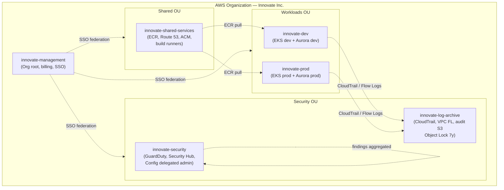
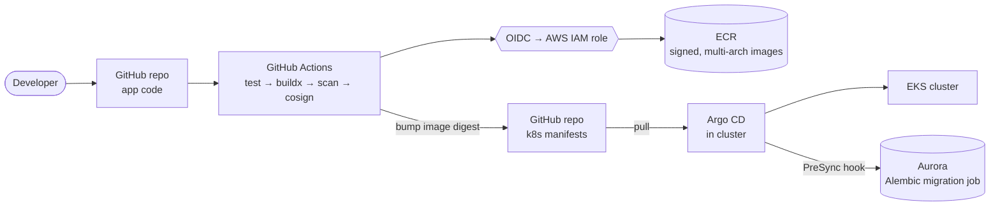

# Innovate Inc. — Cloud Architecture Design

**Cloud:** AWS
**Date:** 2026-05-26
**Status:** Proposed (v1.0)

This document describes the target AWS architecture for Innovate Inc.'s web application (React SPA + Python/Flask REST API + PostgreSQL). It is sized to start small (hundreds of users/day) and scale to millions without re-architecting, while meeting the security bar required for sensitive user data.

The companion Terraform skeleton in [`../terraform/`](../terraform/) already provisions the EKS + Karpenter foundation that this design builds on.

---

## Table of contents

1. [Why AWS](#1-why-aws)
2. [Cloud environment structure (multi-account)](#2-cloud-environment-structure-multi-account)
3. [Network design (VPC)](#3-network-design-vpc)
4. [Compute platform (EKS + Karpenter)](#4-compute-platform-eks--karpenter)
5. [Containerization & CI/CD](#5-containerization--cicd)
6. [Database (Aurora PostgreSQL)](#6-database-aurora-postgresql)
7. [Security & compliance posture](#7-security--compliance-posture)
8. [Observability](#8-observability)
9. [Cost posture & growth roadmap](#9-cost-posture--growth-roadmap)
10. [High-level diagrams](#10-high-level-diagrams)

---

## 1. Why AWS

Both AWS and GCP can deliver this workload well. We recommend **AWS** for Innovate Inc. because:

- **EKS + Karpenter** is mature and is what this repository already provisions, so day-zero engineering effort is the lowest.
- **Aurora PostgreSQL** offers stronger managed-Postgres features than the GCP equivalent for our needs: a decoupled storage layer with 6-way replication, fast in-place failover (~30 s), Global Database for cross-region DR, and Aurora Serverless v2 for cost-efficient non-prod environments.
- **AWS Organizations + Control Tower** gives a well-trodden, auditable multi-account blueprint that scales from a 5-person startup to an enterprise without rework.
- **Marketplace + AWS-native primitives** (KMS, WAF, Shield, GuardDuty, Security Hub, Secrets Manager) cover the sensitive-data compliance story with minimal third-party glue.

The same shape (managed K8s + managed Postgres + multi-project isolation) would be valid on GCP (GKE Autopilot + AlloyDB or Cloud SQL); the recommendation is preference, not exclusion.

---

## 2. Cloud environment structure (multi-account)

We use **AWS Organizations with Control Tower**, landing zones managed as code. Even at startup scale, multi-account isolation is the single highest-leverage security and operational decision — accounts are the only true blast-radius boundary in AWS.

### Initial account layout (6 accounts)

| Account | OU | Purpose |
|---|---|---|
| `innovate-management` | Root | Org root. Billing consolidation, Control Tower, IAM Identity Center (SSO). No workloads. |
| `innovate-security` | `Security` | GuardDuty / Security Hub / Config / IAM Access Analyzer delegated administrator. Read-only auditor role assumable from any account. |
| `innovate-log-archive` | `Security` | Immutable destination for CloudTrail, VPC Flow Logs, ELB / WAF / Aurora logs. Object Lock + cross-region replication. |
| `innovate-shared-services` | `Shared` | ECR registries, Route 53 public zones, ACM certs in `us-east-1` for CloudFront, build runners, internal tooling. |
| `innovate-dev` | `Workloads/Non-Prod` | Dev EKS cluster + Aurora. Lower limits, ephemeral databases, generous developer access. |
| `innovate-prod` | `Workloads/Prod` | Production EKS cluster + Aurora. Locked-down access via break-glass + change tickets. |

Staging is a namespace inside `innovate-dev` initially; it gets promoted to its own account (`innovate-staging`) once we have a release manager or a regulator who requires production-like isolation for pre-prod testing.

### Why this layout

- **Isolation** — A compromised IAM role in `dev` cannot reach `prod` data. Resource-based policies in `prod` reject principals from other accounts by default.
- **Billing** — Each account is a separate billing line in Cost Explorer. "How much does dev cost?" is a one-click question, not a tagging-hygiene exercise.
- **Quotas** — Service quotas (Lambda concurrency, EC2 vCPU, etc.) are per account. Prod gets its own headroom; a dev runaway can't starve prod.
- **Auditability** — All CloudTrail events flow to `log-archive` with Object Lock; even the org root admin cannot tamper with the audit trail.
- **Future-proof** — Adding `staging`, `data`, or a per-customer account later is a Control Tower operation, not a migration.

### Access

- **AWS IAM Identity Center (SSO)** federated to Innovate Inc.'s Google Workspace or Entra ID. No long-lived IAM users for humans.
- **Permission sets** per role: `Developer-NonProd`, `Developer-ProdReadOnly`, `SRE-Prod-BreakGlass` (MFA + approval), `Auditor-ReadOnly`.
- **Workload access** to AWS APIs goes through **IAM roles for service accounts** (IRSA) or **EKS Pod Identity** — pods get scoped, short-lived credentials, never static keys.

---

## 3. Network design (VPC)

Each workload account gets one VPC per region per environment. Identical Terraform module across accounts; only CIDR and tags differ.

### Topology

- **CIDR**: `10.10.0.0/16` (dev), `10.20.0.0/16` (prod), non-overlapping so we can peer or use Transit Gateway later.
- **Three Availability Zones** — minimum for Aurora multi-AZ and EKS control-plane resilience.
- **Four subnet tiers per AZ** (12 subnets per VPC):
  - **Public** (`/24`) — only NAT gateways and the public-facing AWS Load Balancer Controller-managed NLB/ALB live here.
  - **Private — apps** (`/22`) — EKS worker nodes (managed node group + Karpenter-provisioned).
  - **Private — data** (`/24`) — Aurora, ElastiCache, etc. No route to the internet. No NAT route.
  - **Private — egress** (`/26`) — reserved for future egress filtering (e.g. Network Firewall) without re-IP'ing.

  The app subnet is the largest because it carries the per-pod ENIs from the VPC CNI; running out of IPs there is a real failure mode at scale.

### Internet egress

- **NAT Gateways** — one per AZ in prod (the existing POC uses a single NAT for cost; production sets `single_nat_gateway = false`). One NAT per AZ avoids a cross-AZ data-transfer charge on every outbound byte and removes a single point of failure.
- **VPC Endpoints (PrivateLink)** for S3, ECR (api + dkr), STS, Secrets Manager, KMS, CloudWatch Logs, EC2, and SSM. Most pod-to-AWS traffic should never touch a NAT gateway — this is both a cost and a security win.

### Securing the network

| Layer | Control |
|---|---|
| **Edge** | CloudFront (SPA + API) → AWS WAF (managed rule sets: Core, Known Bad Inputs, SQLi, Bot Control, Rate-based rules) → AWS Shield Standard (free; Shield Advanced once revenue justifies the $3k/mo). |
| **DNS** | Route 53 public hosted zone in `shared-services`. DNSSEC enabled. Health checks drive failover routing for DR. |
| **Load balancer** | Internet-facing ALB in the public subnets, provisioned by the **AWS Load Balancer Controller** from Kubernetes `Ingress` resources. TLS terminated at the ALB with ACM-issued, auto-renewed certificates. |
| **VPC** | Security groups (default-deny, allow-list per tier: ALB→apps, apps→data on 5432 only). NACLs left mostly default — security groups are the strong control. |
| **East-west in cluster** | Kubernetes `NetworkPolicy` enforced by the VPC CNI's network-policy engine. Default-deny in `prod`, namespace allow-lists. |
| **Egress** | Phase 2: AWS Network Firewall in the `egress` subnet tier for FQDN-based egress filtering once we have a defined allow-list. |
| **Visibility** | VPC Flow Logs (all subnets, REJECT + ACCEPT) → S3 in `log-archive` → queryable via Athena. GuardDuty consumes the same logs for threat detection. |
| **Private API** | EKS API endpoint is private in prod; admin access is via SSO + AWS Systems Manager Session Manager onto a bastion or the IDE itself. The POC currently leaves it public — see [`terraform/README.md`](../terraform/README.md#production-hardening). |

---

## 4. Compute platform (EKS + Karpenter)

### Cluster topology

- **One EKS cluster per workload account** (`innovate-dev`, `innovate-prod`). Cross-environment isolation is at the account boundary, not the namespace boundary — even with strict RBAC, sharing a control plane between dev and prod is a footgun we won't take.
- **Kubernetes 1.33** today; we follow the n-1 supported version policy and budget one upgrade per quarter.
- **EKS Access Entries** (modern auth) — no `aws-auth` ConfigMap. SSO permission sets map directly to Kubernetes groups.

### Node groups & scaling

We use a **two-tier node strategy**, which is what the existing Terraform already implements:

1. **System managed node group** — small, stable, On-Demand. Runs the things that *must* exist before Karpenter does: CoreDNS, kube-proxy, the Karpenter controller itself, the AWS Load Balancer Controller, the metrics-server, the EBS CSI controller.
   - Prod sizing: 3× `m7g.large` (Graviton) On-Demand, one per AZ, so any single-AZ failure leaves quorum for Karpenter and the AWS LBC.
2. **Karpenter NodePools** — provision every workload node. Configured with:
   - **Capacity types**: `[spot, on-demand]` — Karpenter picks the cheapest viable option, which is Spot ~95% of the time.
   - **Architectures**: `[amd64, arm64]` — Graviton-first where the image supports it (most Python/Flask images do). 20–40% better price/performance.
   - **Instance categories**: `c`, `m`, `r`, generation `>2`.
   - **Consolidation**: enabled — Karpenter rebalances pods onto fewer nodes during quiet hours, deleting empty nodes within a minute.
   - **Spot interruption handling**: SQS + EventBridge listens for the 2-minute Spot interruption warning, Rebalance Recommendations, EC2 state changes, and AWS Health events; Karpenter cordons + drains gracefully.

Separate NodePools by workload class once we have them:

| NodePool | Taints | Used for |
|---|---|---|
| `general` (default) | none | Stateless API, frontend assets, batch jobs |
| `system-critical` | `CriticalAddonsOnly=true:NoSchedule` | Add-ons that need On-Demand only |
| `gpu` (future) | `nvidia.com/gpu=true:NoSchedule` | ML inference if/when the product needs it |

### Resource allocation

- **Requests/limits required** on every workload (enforced by Kyverno policy in prod). Without requests, the scheduler can't bin-pack and Karpenter can't size nodes.
- **Horizontal Pod Autoscaler** on CPU + custom request-rate metric (via the Prometheus adapter) for the Flask API.
- **Pod Disruption Budgets** (`minAvailable: 1` or `maxUnavailable: 25%`) so consolidation and node upgrades can't take a service to zero.
- **Topology spread constraints** — `topologyKey: topology.kubernetes.io/zone, maxSkew: 1` — so a single-AZ outage degrades but doesn't kill a service.

### Why Karpenter over Cluster Autoscaler + ASGs

- **Bin-packing** — Karpenter looks at pending pods' actual requirements and picks the right instance type from a broad set, rather than scaling a fixed-shape ASG.
- **Latency** — node-ready in 60–90 s vs. 2–3 min for ASG-driven scale-out.
- **Cost** — multi-instance-type Spot pools cut interruption rate and let us blend Graviton + x86 without managing five separate node groups.
- **Operations** — no `aws-node-termination-handler` to run separately; Karpenter handles drain natively.

---

## 5. Containerization & CI/CD

### Image build

- **Multi-stage Dockerfiles** for both services.
  - Frontend: `node:22-alpine` builder → `nginx:alpine` runtime serving the static SPA, or hand off the build artifact to an **S3 + CloudFront** static-site origin (preferred at scale — the SPA shouldn't burn pod CPU).
  - Backend (Flask): `python:3.12-slim` base, non-root user, `gunicorn` + `uvicorn` workers, distroless final stage if dependencies allow.
- **Multi-arch builds** — `docker buildx build --platform linux/amd64,linux/arm64 --push` so a single tag works on both Graviton and x86 nodes (the existing Karpenter NodePool already supports both).
- **SBOM + signature** — generated with `syft` and signed with `cosign` (keyless via GitHub OIDC). Admission controller in prod rejects unsigned images.

### Registry

- **Amazon ECR (private)** in `innovate-shared-services`, replicated read-only to the workload accounts' regions.
- **Image scanning on push** (ECR enhanced scanning, powered by Inspector) — CVEs above HIGH block promotion to prod.
- **Immutable tags** — once a tag is pushed it can't be overwritten. Releases are pinned by digest, not by `latest`.
- **Lifecycle policy** — keep last 30 release tags + last 200 PR/branch tags, expire the rest.

### CI/CD pipeline

```
                 ┌────────────────┐
  developer ───▶ │ GitHub (main)  │
                 └───────┬────────┘
                         │ push / PR
                         ▼
                 ┌────────────────┐   OIDC (no static keys)
                 │ GitHub Actions │ ─────────────────────────┐
                 └───────┬────────┘                          │
                         │ test → buildx → scan → cosign     │
                         ▼                                   ▼
                 ┌────────────────┐                ┌──────────────────┐
                 │     ECR        │                │ AWS IAM (assume) │
                 └───────┬────────┘                └──────────────────┘
                         │ image digest
                         ▼
                 ┌────────────────┐
                 │  GitOps repo   │  (bump image: tag)
                 └───────┬────────┘
                         │
                         ▼
                 ┌────────────────┐
                 │   Argo CD      │  in each cluster — pull-based
                 └───────┬────────┘
                         ▼
                  EKS (dev / prod)
```

- **GitHub Actions** for CI (test, build, scan, sign, push). It assumes an AWS role via OIDC — no long-lived AWS keys in GitHub.
- **Argo CD** for CD, one instance per cluster, pull-based. CI's job ends at "ECR has a signed image at digest X"; Argo notices the manifest bump in the GitOps repo and reconciles.
- **Promotion**: dev auto-syncs from `main`. Prod requires a PR against `clusters/prod/` in the GitOps repo, approved by a second engineer.
- **Database migrations**: Alembic, run as a `Job` triggered by Argo's `PreSync` hook. Migrations are forward-compatible (expand → migrate code → contract) so rollbacks never need to undo a schema change.

---

## 6. Database (Aurora PostgreSQL)

### Recommendation: Amazon Aurora PostgreSQL (provisioned)

**Why Aurora over RDS for PostgreSQL or self-managed:**

- **Storage** — Aurora's storage layer is decoupled from compute, replicates 6 ways across 3 AZs, and auto-grows to 128 TiB. Failover doesn't require an EBS snapshot or volume re-attach; it's a DNS flip averaging ~30 s.
- **Read scaling** — Up to 15 read replicas with sub-100 ms replication lag, all sharing the same storage. Adding a replica is a control-plane operation, not a `pg_basebackup`.
- **Backup performance** — Continuous backup to S3, no impact on the writer. Point-in-time restore to any second in the retention window.
- **Global Database** — Cross-region replication with typical lag <1 s; promote a secondary region in ~1 minute for DR.
- **Cost vs. self-managed** — A 3-person startup will not run Postgres better than RDS/Aurora can. The premium over RDS Postgres is real but small relative to the engineering time saved on patching, replication, and failover automation.

**Why not Aurora Serverless v2 for prod (yet):** Serverless v2 is excellent for dev/staging and for prod once we have a steady load profile. For initial launch we use **provisioned** (`db.r7g.large`, Graviton) so we have predictable performance and can rightsize from real metrics. Serverless v2 becomes attractive when traffic is bursty or predictably diurnal — Phase 2.

### Topology

| Environment | Cluster shape | Why |
|---|---|---|
| Dev | 1× `db.t4g.medium` Aurora Serverless v2 (0.5–2 ACU) | Pause-able, cheap |
| Prod | 1 writer + 2 readers on `db.r7g.large` (Graviton), Multi-AZ | Writes go to the primary; reads distributed via the Aurora reader endpoint |

### Backups, HA, DR

- **Multi-AZ HA** — Aurora replicates storage across 3 AZs by default. With at least one reader in a different AZ from the writer, failover is automatic and ~30 s.
- **Automated backups** — 35-day retention (the max), continuous PITR.
- **Manual snapshots** — Monthly, retained 1 year, copied to `log-archive` for compliance.
- **Cross-region DR** — **Aurora Global Database** with the secondary in `us-west-2`. RPO < 1 s (typical), RTO < 5 min (manual promotion via runbook + Route 53 health check failover).
- **Logical backup** — Nightly `pg_dump` to S3 in `log-archive` (encrypted with a different KMS key) as a defense against logical corruption — Aurora's continuous backup recovers from infrastructure failures but not from "we ran the wrong UPDATE."
- **Restore drill** — Quarterly: restore the latest snapshot to a scratch cluster, run schema-level validation, tear down. Recorded in the runbook.

### Connection & security

- **Network**: lives only in the `data` subnets; no public endpoint, no NAT route. Security group allows port 5432 only from the apps SG.
- **Encryption**: at rest with a customer-managed KMS key in the workload account; in transit with TLS (`sslmode=verify-full`, RDS CA bundle baked into the image).
- **Credentials**: stored in **AWS Secrets Manager** with automatic rotation every 30 days. The app reads the secret via the **Secrets Store CSI Driver** — no DB password ever appears in a Kubernetes Secret or env var.
- **Auditing**: PostgreSQL audit extension (`pgaudit`) enabled for DDL + role changes + selected DML on PII tables; logs to CloudWatch and then S3 in `log-archive`.
- **IAM auth** for human access to the DB (engineers assume an SSO role, get a 15-minute IAM token, connect via Session Manager port forward). No shared `postgres` password handed around.

---

## 7. Security & compliance posture

Driven by "sensitive user data is handled."

- **Identity** — IAM Identity Center for humans, IRSA / Pod Identity for workloads. No static keys.
- **Encryption** — KMS customer-managed keys per environment: one for Aurora, one for S3 (per bucket where it matters), one for Secrets Manager, one for EBS. Key policies allow only the intended account + role.
- **Secrets** — AWS Secrets Manager (DB creds, third-party API keys) with rotation. No `.env` files in images.
- **Threat detection** — GuardDuty (S3, EKS, RDS, Malware, Runtime Monitoring) in every account, findings aggregated to the `security` account.
- **Compliance posture** — AWS Config + Security Hub with the AWS Foundational + CIS + PCI DSS rule packs (PCI is a good baseline even pre-PCI scope).
- **Audit** — CloudTrail org trail to `log-archive` with Object Lock (compliance mode, 7-year retention).
- **Edge** — WAF + Shield Standard at CloudFront. Managed rules + a custom rate-based rule on `/api/auth/*`.
- **Image supply chain** — ECR scan-on-push, `cosign` signatures, admission controller (Kyverno or Sigstore policy-controller) rejecting unsigned or HIGH-CVE images in prod.
- **Pod security** — `PodSecurityAdmission` enforcing the `restricted` profile on workload namespaces; baseline elsewhere. Kyverno for organization-specific rules (mandatory labels, image registries, resource requests).
- **PII handling** — Data classification labels on every table; pgaudit logs DML on PII tables; field-level encryption for the highest-sensitivity columns (e.g. SSN, payment) using a KMS-backed envelope-encryption helper in the Flask app.

---

## 8. Observability

- **Metrics** — Amazon Managed Prometheus + Amazon Managed Grafana. Container Insights for EKS-level metrics. Custom app metrics via the Prometheus Python client.
- **Logs** — `fluent-bit` DaemonSet ships container logs to CloudWatch Logs; long-retention copy to S3 in `log-archive`.
- **Traces** — AWS Distro for OpenTelemetry (ADOT) → AWS X-Ray. Flask auto-instrumented; trace IDs propagated through the ALB.
- **Synthetic** — CloudWatch Synthetics canaries hit `/healthz` and one critical user-journey endpoint every minute, from two regions.
- **Alerts** — Alertmanager → PagerDuty for prod, Slack for dev. Burn-rate alerts on SLOs (availability 99.9%, p95 latency 300 ms) — not threshold alerts on raw CPU.

---

## 9. Cost posture & growth roadmap

### Initial monthly cost estimate (us-east-1, hundreds of users/day)

| Component | Monthly |
|---|---|
| EKS control plane (2 clusters: dev + prod) | ~$144 |
| Worker nodes (2× `m7g.large` system + Karpenter Spot for apps) | ~$120 |
| Aurora prod (`db.r7g.large` writer + 1 reader, Multi-AZ) | ~$430 |
| Aurora dev (Serverless v2, mostly paused) | ~$30 |
| NAT × 3 AZs (prod) + 1 (dev) | ~$160 |
| ALB + CloudFront + WAF | ~$60 |
| S3 / ECR / CloudWatch / Secrets Manager | ~$60 |
| GuardDuty / Security Hub / Config | ~$80 |
| **Approx total** | **~$1,100 / mo** |

This is realistic for a startup with a real production environment; it is *not* the cheapest possible setup. The cheapest setup (single NAT, single-AZ Aurora, no WAF, no GuardDuty) would be ~$400/mo but is not appropriate for "sensitive user data."

### Levers as we grow

- **Savings Plans** once steady-state worker spend stabilizes (1-year compute SP covers EKS workers; typical savings 30–40%).
- **Reserved Instances** for the Aurora writer + reader once we're confident in the instance class (1-year RI: ~35% off, 3-year: ~55%).
- **Graviton everywhere** — already the default; ~20% cheaper than equivalent x86.
- **Spot for everything that's stateless** — already the default via Karpenter; expect 60–70% off On-Demand for compute.
- **VPC endpoints** for S3 / ECR / Secrets / KMS — cuts NAT data-transfer by ~70% at scale.
- **Aurora Serverless v2 for prod** once we have a clear bursty/diurnal pattern.

### Growth roadmap

| Phase | Trigger | Action |
|---|---|---|
| **Launch** | Today → first paying users | Single region (`us-east-1`), 3 AZs, prod + dev accounts |
| **Phase 2** | ~10k DAU | Promote staging to its own account; enable Aurora Global Database to `us-west-2`; Shield Advanced if attacked |
| **Phase 3** | ~100k DAU | Active-active read in `us-west-2` via Route 53 latency routing; Aurora reader endpoints per region; CDN-cache more aggressively |
| **Phase 4** | ~1M DAU | Per-tenant or per-region sharding of Postgres; consider DynamoDB for the highest-volume access patterns; dedicated `data` account for analytics (Glue/Redshift/Athena) |

---

## 10. High-level diagrams

### HDL 1 — Multi-account organization



### HDL 2 — Production runtime (single region, `us-east-1`)


### HDL 3 — CI/CD flow



---

## Appendix — assumptions & open questions

- **Region**: assumed primary `us-east-1`, DR `us-west-2`. Confirm based on user geography and any data-residency requirements.
- **Compliance scope**: design satisfies the spirit of SOC 2 / PCI DSS / HIPAA but does not include controls specific to any one of them (BAAs, scoped accounts, etc.). Confirm which regimes actually apply.
- **Engineer count**: design assumes 3–10 engineers initially. At 1–2 engineers, drop dev to a namespace in prod and skip Argo CD; at 20+ add a dedicated platform team and a `staging` account.
- **SLA**: assumed 99.9% availability target. 99.95%+ would push us into active-active multi-region sooner.
- **Out of scope** for v1.0: data warehouse / analytics stack, async job runner (would be SQS + EKS or Step Functions), email / notifications stack, mobile clients.
